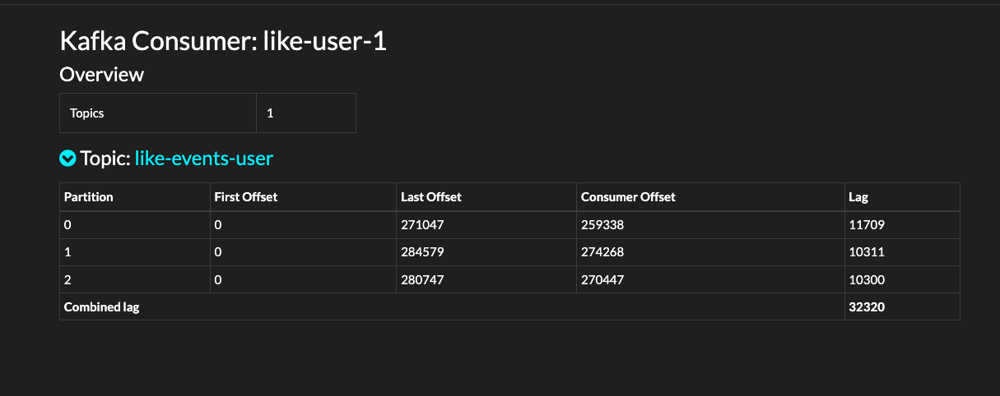
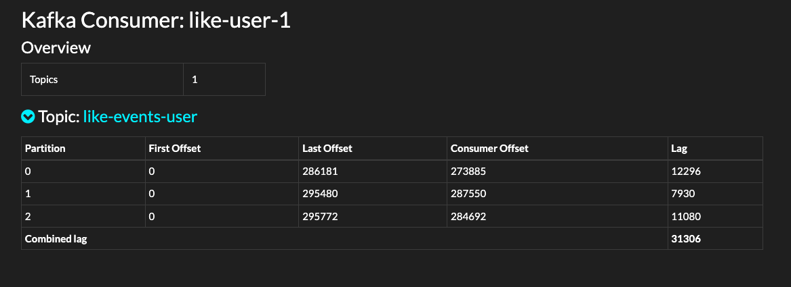
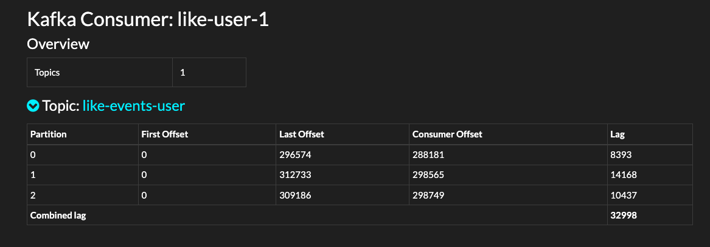
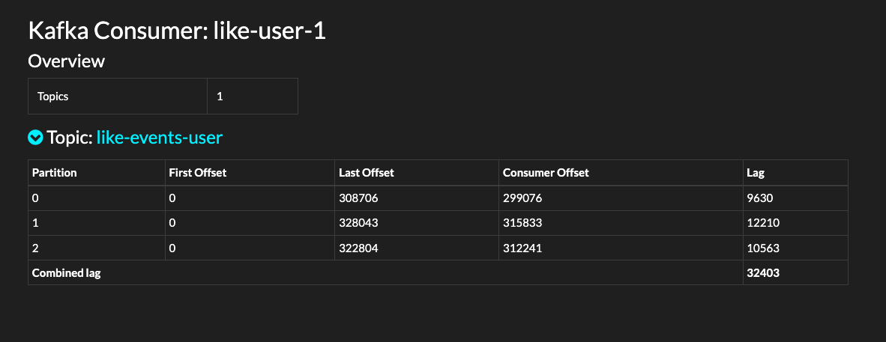
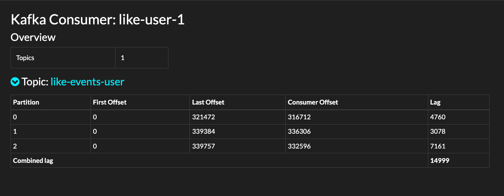

# kafka-test
kafka-performance

## 부하 테스트

### //고려 사항

카프카
    - 주된 목적
    - 좋아야 개수가 유실이 되어도 괜찮은가? 
      - acks = -1
      - `acks = 1` 로 테스트

### 실험방법
k6를 이용한 성능 테스트를 진행한다.
api 요청을 통해 진행

프로듀서와 컨슈머를 따로 구성해야할까?

카프카 구성
1. 브로커 3
2. topic partition 3 replica 2
   - 토픽을 어떻게 구성하는것이 맞나?
     - 방송을 여러개 할 수 있으니, 토픽은 방송별로 생성(like)
   - consumer 3

### 테스트 방법
1. 25초 동안 5만명의 사용자가 요청 => PRODUCING
2. 컨슈머는 2초의 지연현상이 있다고 가정 (Thread sleep) CONSUMING
3. 실시간 렉 확인

### 해결방법
1. 프로듀서 배치 사이즈 늘리기
2. 컨슈머 컨슈머가 최대로 가져 갈 수있는 갯수 늘리기
3. 둘 다 늘리기

#### 프로듀서 배치사이즈 늘리기

테스트 후 25초 렉
> as-is producer 기본 값

> to-be https://www.conduktor.io/kafka/kafka-producer-batching/ < 링크참고하여 설정 BATCH_SIZE_CONFIG 32 linger.time.ms 20

> to-be https://www.conduktor.io/kafka/kafka-producer-batching/ < 링크참고하여 설정 BATCH_SIZE_CONFIG 64 linger.time.ms 20

> to-be https://www.conduktor.io/kafka/kafka-producer-batching/ < 링크참고하여 설정 BATCH_SIZE_CONFIG 64, linger.time.ms 30

별 차이가 없어보여, 컨슈머에서 받는 레코드 수를 증가(MAX_POLL_RECORDS_CONFIG)

<b> 차이 발견!</b>

> BATCH_SIZE_CONFIG 32 linger.time.ms 20, MAX_POLL_RECORDS_CONFIG = 3000

### 공부된 것

> 성능이 좋지 않다고 무조건  토픽의 파티션과 컨슈머를 늘리는 것이 최우선은 아니다.

1. 기본설정으로 카프카 프로듀서는 바로바로 데이터를 보냄.
2. 메시지 배치가 최대 5개까지 동시에 전송될 수 있음
3. `linger.ms` 메시지를 보내기전에 해당 시간에 충족될 때까지 기다렸다가 한번에 보냄, 기본은 0 => 바로바로 보냄
4. `batch.size` 배치에 포함될 최대 바이트 수, 바이트 단위의 사이즈, 해당 크기만큼 쌓일 때까지 있다가 전송, 3번의 설정에 시간이 지나면 쌓이지않아도 전송, 기본은 32kb
5. 생각거리
   1. 만약에 컨슈머설정을 건드리게 된다면, 결국에 리벨런싱이 발생하게 되기때문에 미리 설정을 잘할 것
   2. 메시지 사이즈보다 batch.size가 작을 수 있다고하니 주의해야함, 실제로 메시지가 클 수 있음

